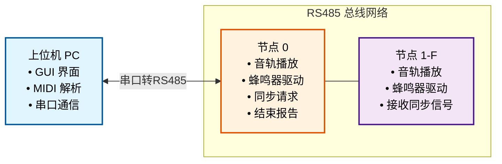

## 项目简介
STC-Choir 是一个基于 STC15F2K60S2 单片机的多机合奏音乐播放系统。该系统能够将 MIDI 音乐文件解析为单片机可播放的格式，通过 RS485 总线实现多台单片机的同步音乐播放，从而实现丰富的多声部电子音乐效果。

## 主要功能
### 🎵 MIDI 文件解析与转换
- 支持标准 MIDI 文件（.mid）的导入和解析
- 自动提取多音轨信息，包括音符、时值、速度等
- 将 MIDI 格式转换为适合单片机处理的自定义编码格式
- 支持音乐同步标记的识别和处理

### 🎼 多机合奏播放
- 支持最多 16 台单片机同时播放不同音轨
- 通过 RS485 总线实现主从机之间的数据传输
- 特殊的同步机制确保音乐对齐播放
- 支持单独预览指定单片机的音轨

### 🔧 灵活的控制方式
- 图形化上位机界面，操作简单直观
- 支持音轨到单片机的灵活分配
- 播放控制（播放、停止）
- 串口连接状态监控和设备管理

## 技术亮点
### 🎯 优化的音频处理
- 精确的频率到定时器数值转换算法
- 符合国际标准音高的音频输出

### ⚡ 优秀的音乐同步
- 特别设计同步协议，减小误差累积

### 🔄 鲁棒的通信协议
- 完整的数据校验机制（异或校验）
- 支持节点 ID 动态配置
- 详细的协议文档（见 [protocol.md](protocol.md)）

### 💾 高效的数据编码
- 紧凑的音乐数据编码格式，节省存储空间
- 适配单片机有限的内存资源

## 系统架构


## 构建与使用
### 上位机程序构建
#### 环境要求
- Python 3.13+
- UV 包管理器（推荐）或 pip

#### 安装依赖
使用 UV（推荐）：
```bash
cd host
uv sync
```

#### 运行程序
```bash
cd host
uv run python gui.py
```

### 下位机固件构建
#### 环境要求
- Keil μVision5 IDE
- STC15F2K60S2 单片机支持包

#### 编译步骤
1. 使用 Keil μVision5 打开 `firmware/music.uvproj` 项目文件
2. 编译项目（Build → Build Target）
3. 生成的 hex 文件位于 `firmware/Objects/music.hex`

#### 烧录程序
1. 使用 STC-ISP 工具烧录 hex 文件到单片机
2. 配置单片机工作频率（默认请使用 11.0592MHz）
3. 根据需要配置节点 ID（通过按键或预设）

### 硬件连接
#### 单片机最小系统
- STC15F2K60S2 单片机
- 11.0592MHz 晶振
- 按键输入电路
- 数码管显示电路
- 蜂鸣器驱动电路
- M24C02 非易失存储模块（用于存储节点信息）

#### RS485 通信
- MAX485 或类似芯片
- 并联A、B 差分信号线和地线，连接所有节点
- 视实际情况在终端添加电阻

## 使用说明
### 基本操作流程
1. **硬件准备**：连接好所有单片机节点和 RS485 总线
2. **节点配置**：为每个单片机分配唯一的节点 ID（0-F）
3. **启动程序**：运行上位机 GUI 程序
4. **加载音乐**：导入 MIDI 文件
5. **分配音轨**：将不同音轨分配给对应的单片机
6. **开始播放**：点击播放按钮，享受多机合奏效果

### 节点 ID 配置
- 通过单片机上的按键可以修改节点 ID
- 节点 0 作为主控机，负责同步协调
- 节点 1-F 作为从机，播放分配的音轨

## 许可证
本项目采用 MIT 许可证，详情请参阅 LICENSE 文件。

## 贡献
欢迎提交 Issue 和 Pull Request 来改进这个项目！

---

*让单片机也能演奏出动听的合奏音乐！* 🎶
